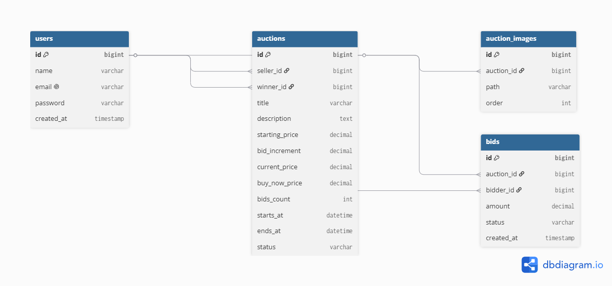

# Lelang App — Backend (Laravel)

Backend REST API untuk platform lelang daring realtime, dibangun dengan Laravel 12, Sanctum (autentikasi), dan Reverb (WebSocket broadcasting).

## Anggota Kelompok

| NIM | Nama |
|-----|------|
| 2401010013 | I Rai Agus Aditya Prayuda |
| ... | ... |
| ... | ... |

## Tech Stack

- PHP 8.2+
- Laravel 12
- MySQL 8
- Laravel Sanctum (autentikasi token-based)
- Laravel Reverb (event broadcasting / WebSocket)
- Queue: database driver
- Scheduler: `schedule:work`

## Fitur

- Registrasi, login, logout (Sanctum token)
- CRUD lelang (create, update, delete — hanya selama status `scheduled`)
- Validasi penawaran (bid) di sisi server: minimum kelipatan, larangan bid lelang sendiri, status aktif, race condition handling via DB lock
- Realtime broadcasting via Reverb:
  - `BidPlaced` — broadcast bid baru ke semua viewer
  - `BidderOutbid` — notifikasi privat ke penawar yang tergeser
  - `AuctionEnded` — pengumuman pemenang otomatis
- Scheduler otomatis: transisi status lelang `scheduled` → `active` → `ended`
- Bonus:
  - Anti-sniping (perpanjang waktu lelang otomatis)
  - Buy Now (beli sekarang, langsung tutup lelang)
  - Presence channel (jumlah penonton aktif)
  - Upload multi-foto lelang

## Prasyarat

- PHP >= 8.2 dengan ekstensi: mbstring, pdo_mysql, openssl, tokenizer, xml, ctype, json, bcmath, fileinfo, curl
- Composer
- MySQL 8 (atau MariaDB kompatibel)
- Node.js >= 18 (untuk asset build, jika diperlukan)

## Instalasi

### 1. Clone repository

```bash
git clone https://github.com/iRaapy/lelang-app.git
cd lelang-app
```

### 2. Install dependencies PHP

```bash
composer install
```

### 3. Konfigurasi environment

```bash
copy .env.example .env
php artisan key:generate
```

Edit `.env`, sesuaikan konfigurasi database:

```env
DB_CONNECTION=mysql
DB_HOST=127.0.0.1
DB_PORT=3306
DB_DATABASE=lelang_db
DB_USERNAME=root
DB_PASSWORD=

SESSION_DRIVER=database
QUEUE_CONNECTION=database
BROADCAST_CONNECTION=reverb

SANCTUM_STATEFUL_DOMAINS=localhost:5173
SESSION_DOMAIN=localhost
FRONTEND_URL=http://localhost:5173
```

### 4. Konfigurasi Reverb (WebSocket)

Variabel berikut harus ada di `.env` (sudah otomatis ditambahkan oleh `reverb:install`, sesuaikan jika perlu):

```env
REVERB_APP_ID=lelang-app
REVERB_APP_KEY=lelangkey
REVERB_APP_SECRET=lelangsecret
REVERB_HOST="localhost"
REVERB_PORT=8080
REVERB_SCHEME=http

VITE_REVERB_APP_KEY="${REVERB_APP_KEY}"
VITE_REVERB_HOST="${REVERB_HOST}"
VITE_REVERB_PORT="${REVERB_PORT}"
VITE_REVERB_SCHEME="${REVERB_SCHEME}"
```

> Nilai `VITE_REVERB_*` ini harus sama dengan konfigurasi `.env` di frontend.

### 5. Buat database

```sql
CREATE DATABASE lelang_db CHARACTER SET utf8mb4 COLLATE utf8mb4_unicode_ci;
```

### 6. Migration + Seeder (akun demo)

```bash
php artisan migrate:fresh --seed
```

### 7. Storage link (untuk upload gambar)

```bash
php artisan storage:link
```

## Menjalankan Aplikasi (Development)

Dibutuhkan **4 terminal terpisah** berjalan bersamaan:

```bash
# Terminal 1 — HTTP server
php artisan serve

# Terminal 2 — WebSocket server (Reverb)
php artisan reverb:start

# Terminal 3 — Queue worker (memproses broadcast event)
php artisan queue:work

# Terminal 4 — Scheduler (auto-transisi status lelang setiap menit)
php artisan schedule:work
```

API akan tersedia di `http://localhost:8000/api`.

## Akun Demo (Hasil Seeder)

| Role | Email | Password |
|------|-------|----------|
| Penjual | penjual@demo.com | password |
| Penawar 1 | penawar1@demo.com | password |
| Penawar 2 | penawar2@demo.com | password |

## Endpoint Utama

### Autentikasi
| Method | Endpoint | Keterangan |
|--------|----------|------------|
| POST | `/api/register` | Registrasi user baru |
| POST | `/api/login` | Login, mengembalikan token |
| POST | `/api/logout` | Logout (hapus token aktif) |
| GET | `/api/me` | Data user yang sedang login |

### Lelang
| Method | Endpoint | Keterangan |
|--------|----------|------------|
| GET | `/api/auctions` | Daftar lelang (filter `?status=active\|scheduled\|ended`) |
| POST | `/api/auctions` | Buat lelang baru |
| GET | `/api/auctions/my` | Daftar lelang milik user login |
| GET | `/api/auctions/{id}` | Detail lelang + daftar bid |
| PUT | `/api/auctions/{id}` | Update lelang (hanya saat `scheduled`) |
| DELETE | `/api/auctions/{id}` | Hapus lelang (hanya saat `scheduled`) |

### Bidding
| Method | Endpoint | Keterangan |
|--------|----------|------------|
| POST | `/api/auctions/{id}/bids` | Tempatkan tawaran baru |

Semua endpoint (kecuali register/login) membutuhkan header:

## Kanal Broadcasting (WebSocket)

| Kanal | Tipe | Event | Keterangan |
|-------|------|-------|------------|
| `auction.{auctionId}` | Private | `BidPlaced`, `AuctionEnded` | Update realtime untuk semua viewer lelang |
| `App.Models.User.{id}` | Private | `BidderOutbid` | Notifikasi personal saat tergeser |
| `presence-auction.{auctionId}` | Presence | - | Jumlah penonton aktif (bonus) |

Otorisasi kanal didefinisikan di `routes/channels.php`.

## ERD



[Lihat versi interaktif di dbdiagram.io](https://dbdiagram.io/d/6a2d20345c789b8acb769f7c)

Ringkasan tabel:

- `users` — akun (bisa berperan penjual & penawar)
- `auctions` — data lelang (relasi ke `seller_id`, `winner_id`)
- `auction_images` — foto-foto lelang (bonus multi-upload)
- `bids` — riwayat penawaran (relasi ke `auction_id`, `bidder_id`)
## Struktur Folder Penting

## Testing Manual (Postman)

Koleksi Postman dapat diimpor dari `docs/postman_collection.json` (jika disediakan), atau test manual mengikuti urutan endpoint pada bagian "Endpoint Utama" di atas.